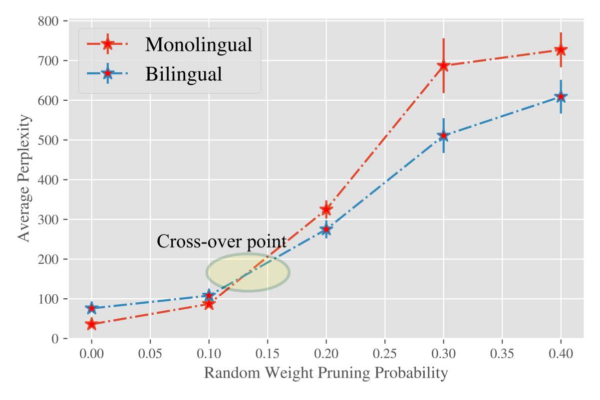
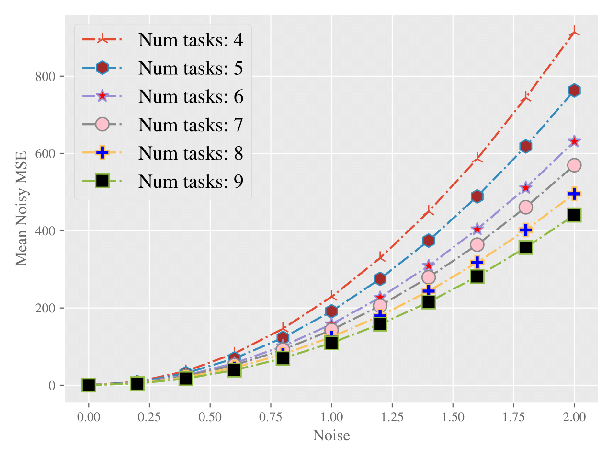
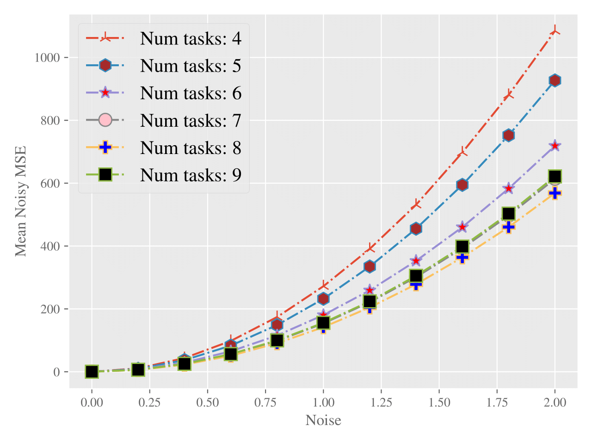

## Multitasking Models are Robust to Structural Failure: A Neural Model for Bilingual Cognitive Reserve

### Abstract
> We find a surprising connection between multitask learning and robustness to neuron failures. Our experiments show that bilingual language models retain higher performance under various neuron perturbations, such as random deletions, magnitude pruning and weight noise compared to equivalent monolingual ones. 
We provide a theoretical justification of this robustness by mathematically analyzing linear representation learning and showing that multitasking creates more robust representations. 
Our analysis connects robustness to spectral properties of the learned representation and proves that multitasking leads to higher robustness for diverse task vectors.

### Results

#### Monolingual vs. Bilingual GPT-2 Experiment: Model perplexity as a function of weight deletion

#### Linear Representation Visual Model Experiments: MSE as a function of additive noise on model weights

##### CIFAR dataset

##### MNIST dataset

### What's here
The code hosted in this repository is the one we used to run all the experiments in the paper.

1) Multi-task Linear Classifier experimentations:
 - binary_classification.py

2) GPT2 monolingual and bilingual fine-tuning, and perturbations test:
 - train_bilingual_gpt2.py
 - test_gpt2.py

3) GPT2ForClassification training and test code for GLUE
 - run_glue_test.py

### Installation
Install the python requirements with `pip install -r requirements.txt`.

Download the models and the tokenizers using the following URLs:

* Monolingual model (finetuned GPT-2): https://bilingualgpt2.blob.core.windows.net/bilingualgpt2/monolingual_web_en_110.pth
* Bilingual Model: (English + Greek) https://bilingualgpt2.blob.core.windows.net/bilingualgpt2/bilingual_ccnews_en_el_110.pth

* Monolingual Tokenizer: https://bilingualgpt2.blob.core.windows.net/tokenizer
* Bilingual Tokenizer: https://bilingualgpt2.blob.core.windows.net/bilingualgpt2

### Acknowledgments

The code for the NLP experiments is exclusively based on the HuggingFace `transformers` [library](https://github.com/huggingface/transformers).
We are very grateful to the authors of the library for their work.
